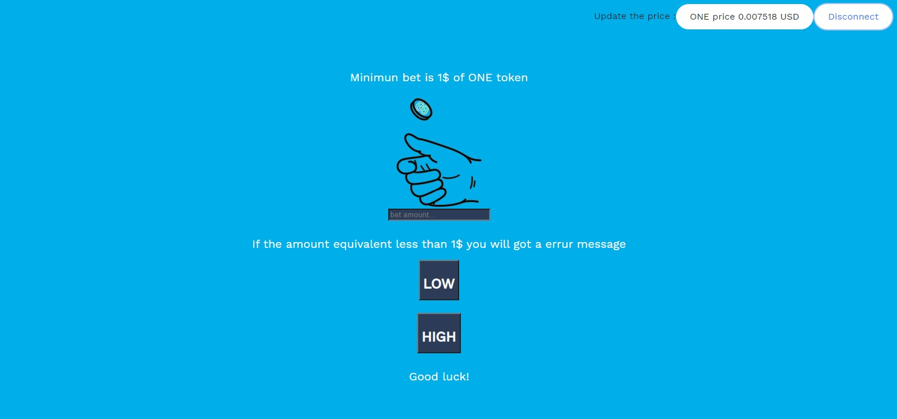

THANKS FOR HARMONY TEAM FOR THIS DEMO https://github.com/harmony-one/token-faucet-demo-dapp 
## Demo  
[](https://youtu.be/F6S1-cxdwRo)


https://siasky.net/AACFZCa5Hom5YguWtobNGmzKtr9r0YbQiNq4YlpLeUddjw
# Bet_to_win_x2 dApp on Harmony

This repo contains a simple Game dApp.the minimun bet is 1usd of ONE. we used Band chain to call ONE/USD price. 50% chance win/lose.

# start the App
clone this repo and install using
```
git clone https://github.com/azizyano/Bet_to_win_x2
yarn 
```
now go ahead and deploy these contracts to Harmony(all done in this repo):
```
truffle compile
truffle migrate --network testnet --reset --skip-dry-run
```
To start the UI on http://localhost:3000.
```
cd ui
yarn start
```

#### A note on MetaMask and web3-react

Harmony isn't currently compatible with MetaMask. There's also nothing similar to [web3-react](https://github.com/NoahZinsmeister/web3-react) right now.

Harmony is looking into both MetaMask support as well as creating a web3-react component compatible with OneWallet and MathWallet.

Depending on when you read this, this tools might (or might not) have been implemented.

#### Development & deployment

The UI resides in the [ui](ui/) folder, so `cd ui` before running the commands below.

To start the UI on http://localhost:3000, just run `yarn start`.

To create a production build, run `yarn build`.
